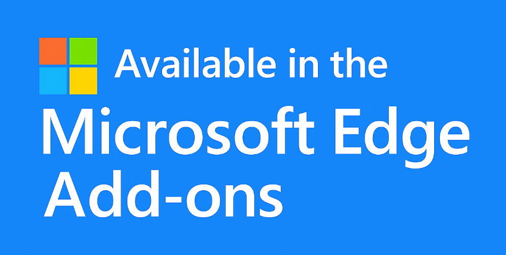
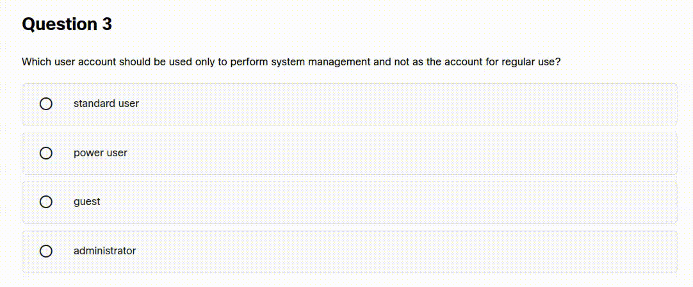
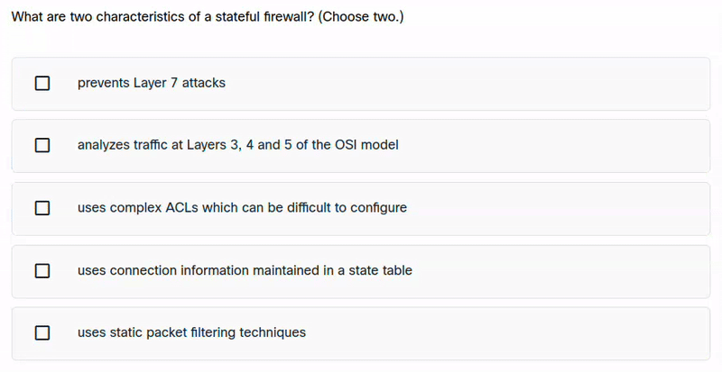

# NetAcad Solver

Browser extension allowing you to pass all the NetAcad quizzes

## ⚠️ The extension doesn't work on final exams ⚠️ ... I need your help

> [!IMPORTANT]
> This web extension doesn't work on final exams, and I'd like to change that. The problem is that final exams are
> rendered differently than regular quizzes. Since final exams are only accessible at the end of major courses, I have no
> way of testing or finding out why the extension isn't working on them.
>
> Because of this, I need an export of any final exam so I can test and fix the extension. Since the Netacad structure
> is
> wrapped in numerous shadow roots and iframes, simply saving the page using Ctrl + S or "Save as" won't work (it wouldn't
> save the content inside the iframes, meaning the test wouldn't download at all). Instead, you need to use an extension
> like [SingleFile](https://chromewebstore.google.com/detail/singlefile/mpiodijhokgodhhofbcjdecpffjipkle) and export it as
> a ZIP. (Note: This must be configured manually in the SingleFile extension settings - otherwise, it saves everything
> into one massive HTML file, which is difficult to edit and look through due to its size).
>
> If anyone manages to export a final exam, please send it to my email at inguin.in@gmail.com, or upload it to a
> file-sharing service and send me the link. Thank you very much!

## Installation

### Automatic Installation:

1. Install the extension
   from [Chrome Web Store](https://chromewebstore.google.com/detail/meowcad-solver/ngkonaonfgfbnobbacojipgndihanmca),
   [Firefox Addons](https://addons.mozilla.org/en-US/firefox/addon/meowcad-solver/)
   or [Edge Addons](https://microsoftedge.microsoft.com/addons/detail/meowcad-solver/pfcpnapfgmahllodcniddcpkelhkdicm)

### Manual installation

  
For Chromium users: (click)

1. Go to [the latest release](https://github.com/ingui-n/musescore-downloader/releases/latest)
2. Download the `netacad-solver-0.x.x-manifest-v3.crx` file
3. Go to the browser extension manager [chrome://extensions/](chrome://extensions/)
4. Enable `Developer mode` (at the top right)
5. Drag and drop the file downloaded in the previous step into the browser window and click to install
6. That's it! Extension is now ready to use 🎉

  
For Firefox users: (click)

1. Go to [the latest release](https://github.com/ingui-n/musescore-downloader/releases/latest)
2. Click to the `netacad-solver-0.x.x-manifest-v2.xpi` file
3. A bubble with text and button should appear. Click on `Continue to Installation` and `Add`
4. That's it! Extension is now ready to use 🎉

## Usage

1. Open your course at [Netacad.com](https://netacad.com/)
2. Use one of following options:

- Click on quiz question and the right option(s) should be selected automatically
- Hover over the answers while holding the `Ctrl` button and the right option(s) should select automatically
- After the correct answer is selected, the extension also tries to submit the question automatically
- Clicking course videos jumps them to the end to mark them as completed faster
- Clicking a tabset/accordion starts traversing the remaining items automatically without repeating finished groups
- Clicking a page tracer resource opens it and then closes the popup automatically
- Submit popups/notify dialogs are closed automatically when NetAcad shows a close button
- Pressing `Alt` toggles a full navigation mode for non-evaluative course content: it scrolls through videos/tabs/accordions/resources, closes popups, and advances page-by-page with next/outline navigation

## Supported browsers

* Firefox
* Chrome
* Opera
* Brave
* Vivaldi
* (basically all Chromium browsers)
